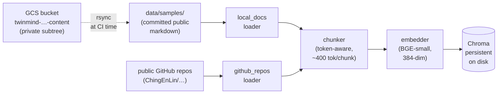
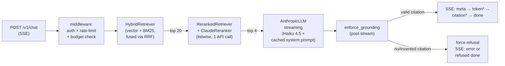

# Architecture

This document describes the shipped system, not a planning artifact. For the reasoning behind specific choices, see `DECISIONS.md`.

## The pipeline at a glance

### Ingestion (offline, runs at image build time in CI)



Three data sources, two loaders, one chunker, one embedder, one persistent vector store. Built once per image at CI time; the resulting Chroma index ships *inside* the Docker image so the runtime path doesn't pay for re-ingest. See `DEPLOYMENT.md` for the bucket-sync mechanics — the gist is that `data/samples/private/` is gitignored and the GCS bucket is its source of truth.

### Query time (online, per request)



Every layer has the same shape: a `base.py` defining a Protocol, a `factory.py` that selects an adapter by name, and an `adapters/` directory with concrete implementations. Switching providers means writing an adapter and adding a branch to the factory — no caller changes.

## Code layout

```
src/twin_mind/
  config.py                 — single source of truth (pydantic-settings, reads .env)
  models/document.py        — Document, Chunk, Source, Citation dataclasses
  pipeline.py               — `index_documents` orchestration

  ingestion/
    base.py                 — Loader Protocol
    factory.py              — make_loaders_for("local" | "github" | "all")
    local_docs.py           — walks data/samples/, yields Documents
    github_repos.py         — pulls READMEs from public GitHub repos

  chunking/
    strategies.py           — token_aware (default) + paragraph chunkers

  embeddings/
    base.py                 — Embedder Protocol (embed + optional embed_queries)
    factory.py              — make_embedder("stub" | "bge")
    adapters/
      stub.py               — hash-based bag-of-words, dim=256, deterministic
      bge.py                — BAAI/bge-small-en-v1.5 via sentence-transformers

  vectorstore/
    base.py                 — VectorStore Protocol + ScoredChunk dataclass
    factory.py              — make_vectorstore("in_memory" | "chroma")
    adapters/
      in_memory.py          — dict + cosine; not persisted, for tests
      chroma.py             — Chroma persistent client (production default)

  retrieval/
    retriever.py            — Retriever: top-K vector retrieval
    bm25.py                 — BM25Retriever over Chunk.text
    hybrid.py               — HybridRetriever: vector + BM25 fused with RRF
    reranked.py             — RerankedRetriever: wraps any retriever, two-stage
    reranker/
      base.py               — Reranker Protocol
      factory.py            — make_reranker("identity" | "cross_encoder" | "claude")
      adapters/
        identity.py         — no-op stub (returns first k unchanged)
        cross_encoder.py    — sentence-transformers CrossEncoder
        claude.py           — single Haiku listwise call (production default)

  generation/
    base.py                 — LLMClient Protocol, LLMStreamEvent, LLMUsage
    factory.py              — make_llm("anthropic")
    adapters/
      anthropic.py          — AsyncAnthropic w/ prompt caching, streams via messages.stream
    prompts/
      system.j2             — stable system prompt (~4300 tokens, cached)
      answer.j2             — per-request template (context + question)
      refusal.j2            — boilerplate (currently unused)
    citations.py            — extract [bracket] tokens, resolve against retrieved
    grounding.py            — post-stream check; forces refusal on no/invented citations

  api/
    app.py                  — FastAPI factory
    state.py                — AppState singleton: retriever + LLM, lazy-loaded
    middleware.py           — CORS, request-id, per-IP token-bucket rate limit
    auth.py                 — Bearer-token verification
    budget.py               — BudgetTracker singleton, UTC-midnight reset
    schemas.py              — request/response Pydantic models
    routes/
      chat.py               — POST /v1/chat (SSE)
      health.py             — GET /v1/healthz

  cli/
    main.py                 — Typer entry: `tm`
    ingest.py               — populate the vector store
    query.py                — one-shot CLI query (uses the same pipeline as the API)
    eval_cmd.py             — runs the eval harness

  eval/
    runner.py               — EvalCase + EvalResult; runs one case end-to-end
    metrics/                — four pure functions over EvalResult:
      retrieval.py          — retrieval_recall@K (objective)
      citation.py           — citation_precision   (objective)
      refusal.py            — refusal_correct     (objective, w/ refusal-reason match)
      groundedness.py       — answer_faithfulness (Haiku-as-judge, --judge only)
```

## Protocols + dataclasses (the type backbone)

```python
# vectorstore/base.py
@dataclass
class ScoredChunk:
    chunk: Chunk
    score: float

class VectorStore(Protocol):
    def upsert(self, chunks: list[Chunk], vectors: list[list[float]]) -> None: ...
    def search(self, query_vec: list[float], k: int) -> list[ScoredChunk]: ...
    def all_chunks(self) -> list[Chunk]: ...
    def __len__(self) -> int: ...

# embeddings/base.py
class Embedder(Protocol):
    name: str
    dim: int
    def embed(self, texts: list[str]) -> list[list[float]]: ...

# retrieval/reranker/base.py
class Reranker(Protocol):
    name: str
    def rerank(
        self, query: str, candidates: list[ScoredChunk], k: int
    ) -> list[ScoredChunk]: ...

# generation/base.py
class LLMClient(Protocol):
    name: str
    async def stream_answer(
        self, question: str, chunks: list[ScoredChunk], max_tokens: int
    ) -> AsyncIterator[LLMStreamEvent]: ...
```

The `ScoredChunk` is the common currency across retrieval, reranking, and generation. Every layer reads `list[ScoredChunk]` and writes `list[ScoredChunk]`, so they compose freely.

## The data flow in one request

1. **Auth + rate-limit middleware** validates the bearer and the per-IP token bucket. Rejected requests never touch Anthropic, so they don't burn budget.

2. **Retrieval** (`HybridRetriever`):
   - Vector branch: embed query with BGE-small (with the `"Represent this sentence for searching relevant passages: "` prefix — see `notes/03`), search Chroma for top-20 candidates.
   - BM25 branch: tokenize, score against the in-memory BM25 index built from all chunks, take top-20.
   - Fuse with **Reciprocal Rank Fusion**: for each chunk, `score = Σ 1/(60 + rank_in_list)`. Rank-based fusion sidesteps the fact that cosine and BM25 produce scores on different scales.

3. **Reranking** (`RerankedRetriever` + `ClaudeReranker`):
   - Top 20 fused candidates are sent to Haiku in a single listwise call.
   - Haiku returns a reordered list of integer indices (JSON array).
   - We take the top 4 as the final retrieved set.
   - Defensive parsing: malformed JSON, duplicate indices, out-of-range indices all gracefully fall back to original order.

4. **Generation** (`AnthropicLLM.stream_answer`):
   - System prompt is sent as a content block with `cache_control: {"type": "ephemeral"}`. The `system.j2` template is intentionally ≥4300 tokens to clear Haiku 4.5's ~4096-token cache minimum.
   - User message is rendered from `answer.j2`: a `<context>` block with the 4 chunks, then the question.
   - `max_tokens` is bounded (400 by default, 100 for forced refusals) so a runaway response can't break the budget.
   - Streamed via `client.messages.stream`.

5. **Citation extraction + grounding enforcement** (`generation/grounding.py`):
   - We accumulate the full streamed text.
   - Extract `[chunk_id]` tokens with `re.compile(r"\[([^\[\]\s][^\[\]]*?)\]")`.
   - If zero citations appear → force refusal (no support).
   - If citations appear but none resolve to a real retrieved chunk → force refusal (invented IDs).
   - If the answer starts with `"I don't have that in my notes"` → already a refusal; classify reason as `out_of_corpus` or `ambiguous_query` via phrase detection.

6. **SSE response** (`api/routes/chat.py`):
   - Order: `meta` (once) → `token` (many) → `citation` (zero or more, live-detected) → `done` (once with cost + token counts), OR a terminal `error` (`BUDGET_EXCEEDED` / `UPSTREAM_ERROR`).
   - Frames are CRLF-delimited per the spec.

## Prompt caching — the load-bearing detail

Anthropic's prompt caching reduces cached-prefix input tokens by ~90% in cost. For Haiku 4.5, the minimum cacheable prefix is approximately **4096 tokens**.

`prompts/system.j2` is intentionally written to be ≥4300 tokens of substantive content (rules, exemplars, pitfalls). Shrinking it below the threshold causes caching to silently stop firing — `cache_creation_input_tokens` and `cache_read_input_tokens` both go to 0 in the response, and you'll pay full price on every request without any error.

The per-request grounding chunks live in `answer.j2` (the user message). Putting them in the system block would invalidate the cache on every query.

Cache metrics live in `LLMUsage`:
```python
@dataclass
class LLMUsage:
    input_tokens: int
    output_tokens: int
    cache_creation_input_tokens: int  # paid full + 25% the first time
    cache_read_input_tokens: int      # paid 10% on subsequent requests
```

Pricing constants are in `config.py`:
```python
PRICE_INPUT_PER_MTOK         = 1.00   # USD per million regular input tokens
PRICE_OUTPUT_PER_MTOK        = 5.00
PRICE_CACHE_WRITE_PER_MTOK   = 1.25   # 25% premium on first write
PRICE_CACHE_READ_PER_MTOK    = 0.10   # 90% discount on reads
```

## Adapter pattern in action

Every "what implementation should we use" decision is one config knob:

```python
# config.py
EMBEDDER: str           = "bge"           # "stub" | "bge"
VECTORSTORE: str        = "chroma"        # "in_memory" | "chroma"
RETRIEVAL_MODE: str     = "hybrid"        # "vector" | "bm25" | "hybrid"
RERANKER: str           = "claude"        # "none" | "identity" | "cross_encoder" | "claude"
```

State.py wires them together at startup:

```python
embedder  = make_embedder(settings.EMBEDDER)
store     = make_vectorstore(settings.VECTORSTORE)
vector    = Retriever(embedder, store, top_k=settings.TOP_K)
base      = HybridRetriever(vector, BM25Retriever(store.all_chunks()))
if settings.RERANKER != "none":
    retriever = RerankedRetriever(base, make_reranker(settings.RERANKER))
else:
    retriever = base
```

This shape made Phase 5's three-way reranker bake-off (none / cross-encoder / Claude) a one-line config flip per run. The eval surfaced that the "obvious" cross-encoder choice actually regressed — see `DECISIONS.md`.

## State + lifecycle

`api/state.py:AppState` is a process-wide singleton with a lock:

- `ensure_index()` — lazy-loads the retriever. On first request it builds the embedder, opens the persistent Chroma store, and if the store is empty, bootstraps from `BOOTSTRAP_SOURCE` (default `"local"`). Subsequent requests reuse the cached retriever.
- `llm()` — lazy-loads `AnthropicLLM`. Reuses the same `AsyncAnthropic` client (which has its own connection pool).

This means: the *first* request after a cold start pays the cost of loading BGE weights (~1-2s) and opening Chroma. Subsequent requests are pure RPC time. The Docker image bakes a pre-built Chroma index and pre-downloaded BGE weights, so this isn't an embedding pass — just file opens.

## What's intentionally NOT here

- **Conversation memory.** The API accepts a `session_id` field but the backend ignores it. Phase 6+ work.
- **Streaming reranker output.** Reranking blocks for ~500ms-1s; we don't try to overlap it with the LLM call. Optimizing this would require speculative retrieval + reranking and isn't worth the complexity at this scale.
- **An LLM-as-reranker fusion stage.** Considered, deferred. The current setup gets to 0.9+ on retrieval recall with one extra API call per query; further refinement has diminishing returns.
- **Admin reindex endpoint.** `POST /v1/admin/reindex` is in the API contract as a Phase 6+ deferred item. Currently, content updates require a redeploy (which auto-rebuilds the Chroma index in the image).

## Where to read next

- **`API.md`** — exact wire format, SSE event shapes, error codes, auth
- **`EVAL.md`** — the harness, the four metrics, the golden set, how to add cases
- **`DEPLOYMENT.md`** — infra walkthrough, Cloud Run + Terraform + CI/CD
- **`DECISIONS.md`** — the "why" behind the architectural choices above
