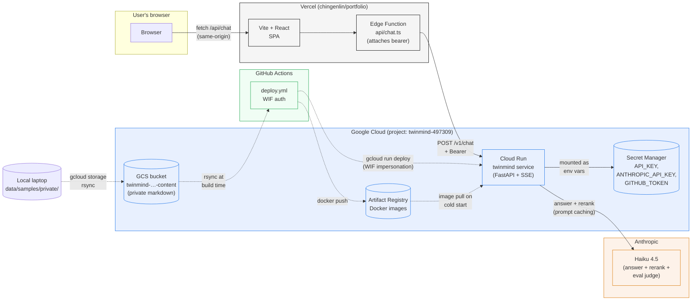

# Deployment

How TwinMind is hosted, how it gets there, how to operate it, and what it costs.

## System architecture



Solid arrows are the **runtime request path** (one user message → response). Dashed arrows are the **deploy / content-update path** (happens at deploy time, not per request).

## Stack

| Layer | Choice |
|---|---|
| Hosting | Google Cloud Run (managed, scale-to-zero) |
| Container registry | Artifact Registry |
| Secrets | Secret Manager |
| Source-of-truth for private corpus | GCS bucket (one bucket, versioned) |
| Infrastructure as code | Terraform |
| CI/CD | GitHub Actions + Workload Identity Federation |
| Image strategy | Multi-stage Dockerfile, Chroma index baked at build time |

GCP project: `twinmind-497309`. Region: `us-central1`.

## Why Cloud Run (and why not the alternatives)

**Cloud Run won** because for a low-traffic portfolio chatbot:

- Free tier (2M req/mo) covers more traffic than the site will ever see → realistic monthly cost is **$0**.
- Native SSE support; the 60-minute request timeout is far beyond what we need.
- Scale-to-zero means no charges when idle.
- Container-native — fits the Dockerfile-as-artifact model we already wanted.

What we considered and rejected:
- **Vercel** for the backend itself: Python serverless functions on Vercel cap at 10s on the Hobby tier (would break SSE), and Edge functions need JS/TS. Vercel hosts the *portfolio*, which proxies to Cloud Run.
- **Fly.io**: ~$5/mo for always-warm. Real cost when you want to avoid cold starts, but cold starts are tolerable on a portfolio.
- **Render**: free tier has 30s cold starts (worse than Cloud Run); paid tier $7/mo.
- **AWS Lambda + API Gateway**: SSE on Lambda is painful (needs Function URLs with response streaming, not API Gateway). Not worth the complexity at this scale.

The cold-start tax on Cloud Run (~5-8s) is paid by the *first* visitor of the day; subsequent messages in the same conversation are warm. For a portfolio that's an acceptable trade.

## Infrastructure (Terraform)

```
terraform/
  versions.tf            — provider versions + project/region
  variables.tf           — inputs (project_id, region, secrets, scaling knobs)
  main.tf                — Artifact Registry, secrets, runtime SA, Cloud Run service
  wif.tf                 — Workload Identity Federation for GitHub Actions
  content.tf             — GCS content bucket + IAM for build-time pulls
  outputs.tf             — service URL, image URI, WIF provider, deploy SA email
  terraform.tfvars       — local, gitignored, contains secrets
  terraform.tfvars.example — template (committed)
```

### What gets provisioned

| Resource | Purpose |
|---|---|
| `google_artifact_registry_repository.twinmind` | Holds the Docker image |
| `google_storage_bucket.content` | Source of truth for `data/samples/private/` (gitignored) |
| `google_secret_manager_secret.{anthropic_api_key, api_key, github_token}` | Runtime secrets, mounted as env vars |
| `google_service_account.runtime` | Cloud Run service identity (least-privilege: only secret-accessor on the three secrets) |
| `google_service_account.deploy` | CI deploy identity (AR writer, Run admin, actAs on runtime SA) |
| `google_iam_workload_identity_pool{,_provider}.github` | Lets GitHub Actions OIDC mint tokens for the deploy SA |
| `google_cloud_run_v2_service.twinmind` | The actual service (1 vCPU / 1Gi, scale-to-zero default, max 3) |
| `google_cloud_run_v2_service_iam_member.public` | `allUsers` invoker (auth is handled in-app by the bearer check) |

### Scaling + resources

```hcl
# terraform/variables.tf defaults
cpu              = "1"
memory           = "1Gi"
min_instances    = 0       # scale to zero when idle (free-tier friendly)
max_instances    = 3       # ceiling against runaway scale + cost
timeout          = "300s"  # SSE-friendly; well under Cloud Run's 60-min cap
```

1Gi is more than enough — BGE-small + Chroma + Python runtime fits comfortably. The reranker is API-only (no model in memory).

To trade $0/mo for no cold starts, bump `min_instances = 1` (~$5/mo for an always-warm instance).

## CI/CD (GitHub Actions)

Two workflows live in `.github/workflows/`:

- **`ci.yml`** — lint + tests on every push; smoke eval gated by `run-eval` PR label.
- **`deploy.yml`** — builds container, pushes to AR, deploys new Cloud Run revision. Triggered by push to `dev` or manual `workflow_dispatch`.

The deploy workflow steps:

1. `actions/checkout@v4` — pull the repo (only public content; private/ is gitignored).
2. `google-github-actions/auth@v2` — exchange GitHub OIDC for an access token impersonating `twinmind-deploy@`. No JSON keys in repo secrets.
3. `gcloud storage rsync` — pull the authoritative corpus from the content bucket into `data/samples/private/`. After this step the build context has the same content a local build would see.
4. `docker build && docker push` — image tagged with both the commit SHA (immutable) and `:latest` (convenience).
5. `gcloud run deploy` — create a new revision pointing at the SHA-tagged image, with `--service-account=twinmind-runtime@...` so we don't trip the default-compute-SA actAs check.

Concurrency is gated to `deploy-${{ github.ref }}` with `cancel-in-progress: true`, so a fast push series doesn't deploy stale images.

### Required GitHub secrets

| Secret | Source |
|---|---|
| `GCP_WIF_PROVIDER` | `terraform output wif_provider` |
| `GCP_DEPLOY_SA` | `terraform output deploy_service_account` |

Set on the repo at Settings → Secrets and variables → Actions.

### Why split build-time content sync from the Dockerfile

The content rsync runs in the *workflow*, not the Dockerfile. Two reasons:

1. **The build needs no GCP credentials.** A clean Dockerfile that just reads `data/` from the build context works on any machine. If the rsync lived in a `RUN gcloud storage cp` step, we'd need to mount credentials into Docker, which adds attack surface and breaks local builds.
2. **Local dev stays simple.** `docker build .` on a laptop uses the local filesystem `data/` — no GCS round-trip required.

## The Dockerfile in detail

Multi-stage. Three stages:

```dockerfile
# Stage 1: uv-bin — single-binary uv from a published image
FROM ghcr.io/astral-sh/uv:${UV_VERSION} AS uv-bin

# Stage 2: builder — install deps, pre-download BGE, build Chroma index
FROM python:3.11-slim AS builder
COPY --from=uv-bin /uv /usr/local/bin/uv
COPY pyproject.toml uv.lock README.md ./
RUN uv sync --frozen --no-dev --no-install-project
COPY src ./src
COPY data ./data
RUN uv sync --frozen --no-dev
RUN python -c "SentenceTransformer('BAAI/bge-small-en-v1.5')"  # cache the model
RUN --mount=type=secret,id=github_token tm ingest --source all  # build the Chroma index (private corpus + public GitHub repos)

# Stage 3: runtime — python:3.11-slim with only deps + index + cache + source
FROM python:3.11-slim AS runtime
COPY --from=builder /app/.venv /app/.venv
COPY --from=builder /app/src   /app/src
COPY --from=builder /app/data  /app/data
COPY --from=builder /app/.hf-cache /app/.hf-cache
USER twinmind
CMD ["sh", "-c", "uvicorn twin_mind.api.app:app --host 0.0.0.0 --port ${PORT}"]
```

Key design points:

- **Pre-built Chroma index in the image.** Cold start is "open file from disk", not "build index from documents." Costs image size; buys ~5s instead of ~60s cold start.
- **Pre-downloaded BGE weights in the image.** Same idea — no Hugging Face round-trip on first request.
- **`uv` is a build-stage import, not a runtime dep.** The runtime image only ships `.venv`, not `uv` itself.
- **Non-root user.** Cloud Run doesn't strictly require it but it's good hygiene.
- **`ARG UV_VERSION` requires an alias stage.** BuildKit substitutes ARGs in `FROM` directives but *not* in `COPY --from=<image>:<tag>`. Aliasing the uv image as its own stage (`AS uv-bin`) and referencing the stage name in the COPY sidesteps this.

Final image size: ~1.5GB (mostly torch + sentence-transformers + the BGE weights). Cloud Run pulls this once per cold start.

## Content source of truth

`data/samples/private/` is the **authoritative corpus** that the production image ingests. The Dockerfile's builder stage sets `SAMPLES_DIR=data/samples/private` for the `tm ingest` step, so only this subtree ends up in the baked Chroma index. It's gitignored because it contains personal details we don't want in the public repo. The single source of truth for it is:

```
gs://twinmind-497309-twinmind-content
```

The bucket has object versioning enabled (keeps 5 prior versions of each file), so a bad edit is one rollback away.

**Update flow:**
```bash
# Edit markdown locally in data/samples/private/...
gcloud storage rsync -r data/samples/private/ gs://twinmind-497309-twinmind-content
# Trigger redeploy:
gh workflow run deploy.yml --ref dev
```

The other markdown under `data/samples/` (`background.md`, `experience/*`, `projects/*`) is Phase 1 dev-fixture content — committed to git, but only ingested in **local dev and eval runs** (when `SAMPLES_DIR` is at its default `data/samples`). The production Docker build pins `SAMPLES_DIR=data/samples/private` so those fixtures don't end up in the deployed Chroma index. The eval golden set's `expected_sources` are written against the fixture file names (`experience/virtonomy.md`, `projects/querypal.md`, etc.), so keeping them locally is what lets the historic eval baseline still run; a future task is to rewrite the eval against the real private-corpus source names and retire the fixtures.

Alongside the private corpus, the production build also pulls READMEs and `docs/*.md` from every public repo owned by `$GITHUB_USER` (default `ChingEnLin`), minus `$GITHUB_DENYLIST`. The PAT is mounted as a BuildKit secret (`--secret id=github_token,env=GITHUB_TOKEN` in the CI build step, sourced from the `GH_INGEST_TOKEN` repo secret) so it never lands in any image layer or build history. If no token is mounted (e.g. a local `docker build .` without `--secret`), the build silently falls back to `--source local` and only the private corpus is indexed.

GCS cost at this scale: a few MB of markdown, well inside the 5GB free tier. Realistic cost: **$0/mo**.

## Auth: how the bearer flows through

```
Browser ─────fetch /api/chat (same-origin)─────▶ Vercel Edge proxy
                                                      │
                                                      │ attaches `Authorization: Bearer $TWINMIND_API_KEY`
                                                      ▼
                                                Cloud Run service
                                                      │
                                                      │ middleware/auth.py checks against $API_KEY env var
                                                      ▼
                                                Anthropic API call
```

- The bearer never reaches client JavaScript.
- The bearer in Vercel and the `API_KEY` Secret Manager value must match. Rotate by:
  1. `terraform apply` with a new `api_key` var (writes a new Secret Manager version)
  2. Update `TWINMIND_API_KEY` in Vercel
  3. Trigger a Cloud Run revision (so it picks up the new secret version)
  4. Either deploy via `gh workflow run deploy.yml --ref dev` (rebuilds + redeploys) or use the GCP console to redeploy the same image with the latest secret version.

WIF (in `terraform/wif.tf`) is what lets CI authenticate to GCP without long-lived JSON keys. Two role grants on the deploy SA:

- `roles/iam.workloadIdentityUser` — lets the WIF principal mint OIDC ID tokens for the SA (the basic handshake).
- `roles/iam.serviceAccountTokenCreator` — lets it call `iam.serviceAccounts.getAccessToken` so that subprocess CLIs (gcloud, docker via gcloud creds) can impersonate it for actual API calls. Without this, OIDC succeeds but every subsequent API call returns `PERMISSION_DENIED`.

## Bootstrap from zero

Assuming a fresh GCP project (or no Terraform state yet):

```bash
# 1. Local gcloud auth
gcloud config set project twinmind-497309
gcloud auth login
gcloud auth application-default login

# 2. Fill in tfvars
cp terraform/terraform.tfvars.example terraform/terraform.tfvars
# Edit terraform.tfvars with project_id, github_repository, allowed_origin,
# anthropic_api_key, api_key.

# 3. First apply (skips the Cloud Run service — needs image first)
cd terraform
terraform init
terraform apply \
  -target=google_artifact_registry_repository.twinmind \
  -target=google_storage_bucket.content \
  -target=google_secret_manager_secret_version.anthropic_api_key \
  -target=google_secret_manager_secret_version.api_key \
  -target=google_secret_manager_secret_version.github_token \
  -target=google_iam_workload_identity_pool_provider.github \
  -target=google_service_account.deploy \
  -target=google_service_account.runtime
terraform apply  # then full apply (still skips service if image absent — that's fine)

# 4. Upload private content
gcloud storage rsync -r data/samples/private/ gs://twinmind-497309-twinmind-content

# 5. Add the two CI secrets to GitHub
terraform output wif_provider          # → GCP_WIF_PROVIDER
terraform output deploy_service_account # → GCP_DEPLOY_SA

# 6. Push to dev (or workflow_dispatch on deploy.yml)
git push origin dev

# 7. After the first successful deploy, re-import the service into TF state
#    if it was created by gcloud rather than Terraform:
terraform import google_cloud_run_v2_service.twinmind \
  projects/twinmind-497309/locations/us-central1/services/twinmind
terraform apply  # binds public-invoker IAM, syncs state

# 8. Grab the URL
terraform output service_url
```

The order is "infrastructure first, image+service second" because Cloud Run can't deploy a service without an image, and CI can't push an image without the AR repo + IAM bindings.

## Observability

What's there today:

- **Cloud Run native metrics**: request count, latency (p50/p95/p99), instance count, CPU/memory utilization. Visible at https://console.cloud.google.com/run/detail/us-central1/twinmind.
- **Cloud Logging**: stdout from the container is auto-captured. Filter with `resource.type="cloud_run_revision"`.
- **Cost in-band**: every `done` SSE event includes `cost_usd` for that request. The `BudgetTracker` (in-process) sums the day's spend.
- **Request IDs**: every request has a `request_id` in the `meta` event, propagated through logs.

What's deferred:

- **Latency / cost dashboards** as separate Cloud Monitoring resources. Cloud Run's built-in metrics view covers the basics; dedicated dashboards are a "when you actually need them" thing.
- **Alerts** on budget exhaustion or 5xx rate. Would be ~30 lines of Terraform with `google_monitoring_alert_policy`.

## Cost

At the current traffic profile (low — personal portfolio):

| Item | Pricing | Monthly estimate |
|---|---|---|
| Cloud Run requests | $0.40 / 1M requests after 2M free | $0 (well inside free tier) |
| Cloud Run CPU+memory | per-100ms × instance count | $0-2 (scale-to-zero) |
| Artifact Registry | $0.10/GB/mo | <$0.01 |
| GCS storage | $0.020/GB/mo | <$0.01 |
| Secret Manager | first 6 active versions free | $0 |
| Anthropic Haiku 4.5 | $1/$5 per Mtok input/output, $0.10/$1.25 cache read/write | bounded by `DAILY_BUDGET_USD` ($0.50/day cap) |
| **Total infra** | | **~$0-2/mo** |
| **Total inc. LLM** | | **bounded by daily cap × 30** |

The Anthropic line item is the variable cost. Per-query cost is typically $0.005-0.015 (one rerank call + one answer call, with prompt caching reducing the system-prompt-input cost by 90% after the first request). At 100 queries/day that's ~$1.50/day — well over the default $0.50 daily cap. Either bump the cap or accept that the cap will trip during heavy use.

## Failure modes + how to recover

| Symptom | Likely cause | Recovery |
|---|---|---|
| `503 BUDGET_EXCEEDED` on every request | Daily cap hit | Wait until UTC midnight, or `terraform apply` with a higher `daily_budget_usd` |
| `403 Forbidden` from Cloud Run | `allUsers` invoker IAM not bound | `terraform apply` — the `google_cloud_run_v2_service_iam_member.public` resource should bind it |
| Cold start times out (Cloud Run kills the container) | BGE cache or Chroma open is slow on first request | Bump `startup_probe.failure_threshold` in `main.tf` (currently 6 × 10s = 60s budget) |
| CI deploy fails with `iam.serviceAccounts.getAccessToken denied` | Missing `serviceAccountTokenCreator` on deploy SA | Already in `wif.tf` — make sure it's applied (`terraform apply -target=google_service_account_iam_member.wif_deploy_token_creator`) |
| Answer cites private/ but only public sources expected | Corpus-dedup issue (private mirrors public content) | Out of scope for the deployment layer; see EVAL.md |

## Updating content without redeploying code

Currently: not possible without a redeploy. The Chroma index is baked into the image.

Future paths if this becomes a pain point:

- **Runtime fetch with chroma rebuild** — adds ~30s to cold start.
- **Persistent volume mount** — Cloud Run doesn't natively support this (other than GCS Fuse, which has latency tradeoffs).
- **Admin reindex endpoint** — `POST /v1/admin/reindex` with a separate admin key, fetches latest from GCS, rebuilds in-memory while serving old index, swaps atomically. Roughly 40 lines of code. Deferred until needed.

For now, content updates take one rsync + one workflow_dispatch (~3 min end-to-end). That's been fine in practice.
